# 4. How it fits together

[← Previous: The components](03-components.md) | [Index](00-index.md) | [Next: Technical elements →](05-technical-elements.md)

---

```mermaid
flowchart TD
    GH[GitHub<br/>issues, PRs, checks] -->|webhook| W[Dispatch<br/>existing today]
    W --> X[translate&#40;&#41;<br/>raw payload → domain event]
    X -->|domain event or drop| DO[Durable Object<br/>issue-412]

    DO -->|read current state| GH
    DO --> R[reduce&#40;&#41;<br/>pure function]
    R --> T[(transition table<br/>graph.ts)]
    R -->|fire or drop| DO

    DO -->|set state label| GH
    DO -->|append row| D1[(D1<br/>transition log)]
    DO -->|upsert row| CS[(D1<br/>current-status view)]
    DO -->|POST /routines/id| CR[Claude Code Routine]
    DO -.->|setAlarm 30min| DO

    CR -->|outcome: comment, push, check<br/>authoritative| GH
    CR -.->|progress heartbeat<br/>best-effort, diagnostic-only| DO

    DASH[Dashboard] -->|read on load| CS

    style R fill:#3544B1,color:#fff
    style T fill:#3544B1,color:#fff
    style X fill:#3544B1,color:#fff
```

The new material versus what exists today is the translator, the DO, the
reducer and the table. The GitHub → dispatch → fire path already exists.

The critical detail: **the routine does not call us back with its outcome.**
It writes the outcome to GitHub, and GitHub sends us a webhook — same door as
every other event. If a session dies mid-way, whatever it already wrote to
GitHub survives; there's no lost callback for anything that actually decides
state.

The one dashed exception is the progress heartbeat (§3.4): a direct,
best-effort call from the routine straight to the DO, reporting "currently
at step X." It's allowed to be a callback specifically because it's
diagnostic-only — it never reaches `reduce()`, and losing one just means a
less informative `state:stuck` comment later, not a wrong transition. The
solid arrows above are the ones the correctness of the system depends on;
the dashed one exists purely to make failures easier to read.

The current-status table (§3.6) and the dashboard reading it sit entirely
off to the side of all of this — the DO upserts a row into it on every
transition and every heartbeat, purely as a side effect, and nothing in the
decision path (`translate()`/`reduce()`) ever reads it back. It's a mirror
for humans, not an input.

## The full cycle

1. Something happens on GitHub → webhook → dispatch
2. `translate()` turns the raw payload into a domain event, or drops it (own-bot writes, non-required check runs still pending, etc. — see [03-components.md §3.0](03-components.md#30-the-event-translator-new))
3. Domain event routes to DO `issue-412`
4. DO reads the current label fresh from the API
5. DO calls `reduce(state, event)`
6. `null` → drop and log. A rule → continue
7. DO sets the new label, appends to D1, fires the routine, sets the alarm
8. Routine works, writes result to GitHub
9. GitHub webhook → dispatch → translate → same DO
10. DO cancels the alarm, back to step 4

Steps 1 and 9 are the same path. One place decides, and it decides the same
way every time.

---

[Next: 05 — Technical elements →](05-technical-elements.md)
