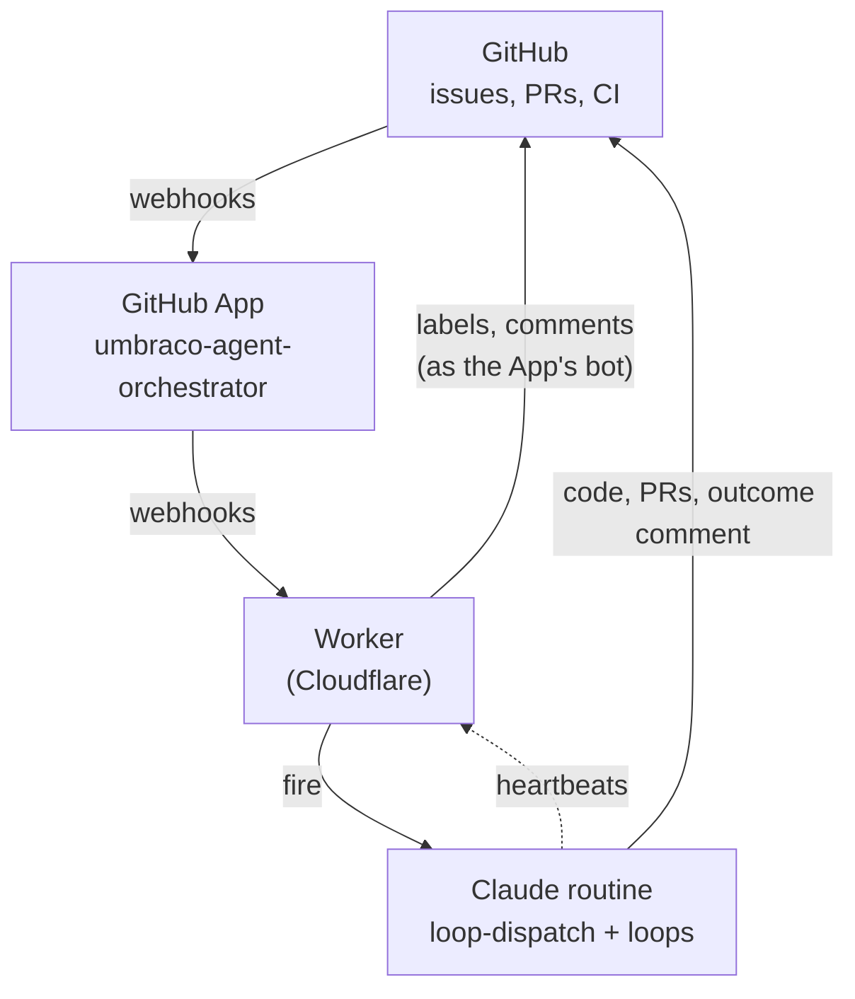
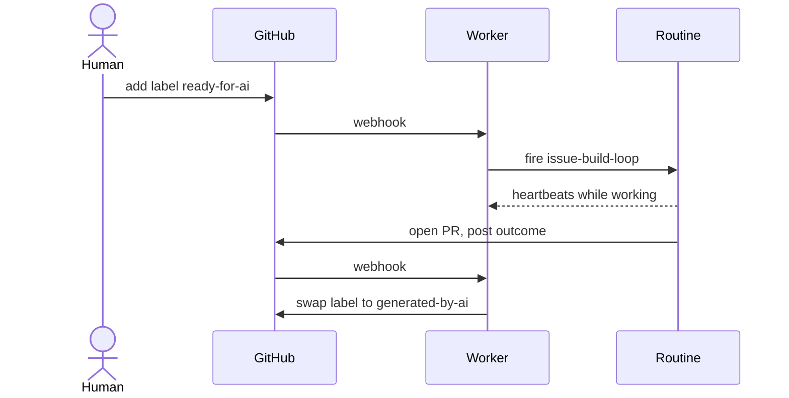
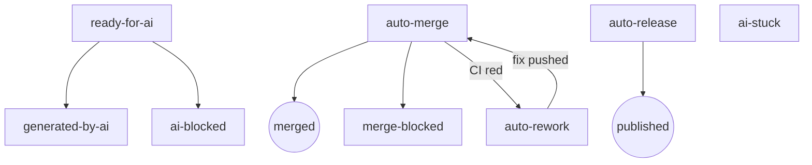
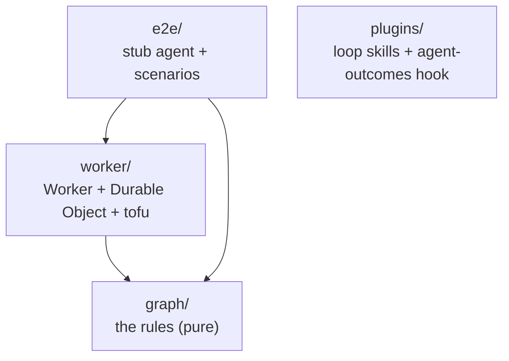
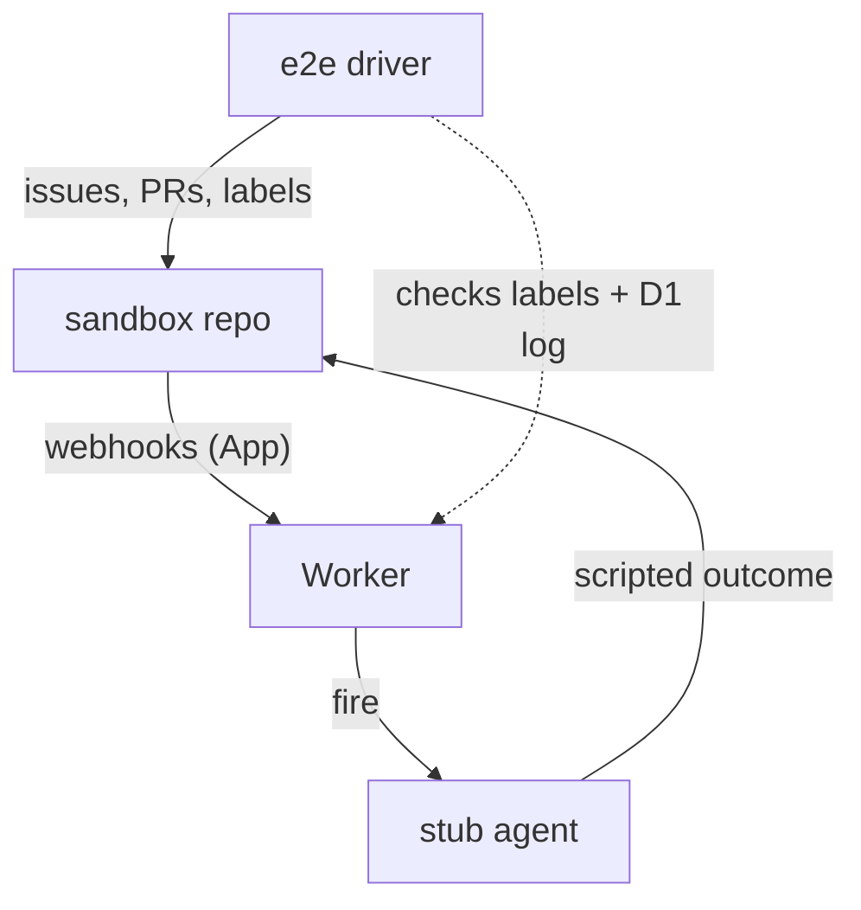

# 4. How it fits together

[← Previous: The components](03-components.md) | [Index](00-index.md) | [Next: Technical elements →](05-technical-elements.md)

---

How the system works as built (02-10-2026). Five simple views: the parts,
one run, the labels, the code, and how it's tested.

## The parts

```mermaid
%%{init: {"themeVariables": {"fontSize": "20px"}, "flowchart": {"nodeSpacing": 40, "rankSpacing": 60}}}%%
flowchart TD
    GH["GitHub<br/>issues, PRs, CI"]
    APP["GitHub App<br/>umbraco-agent-orchestrator"]
    W["Worker<br/>(Cloudflare)"]
    R["Claude routine<br/>loop-dispatch + loops"]

    GH -- "webhooks" --> APP
    APP -- "webhooks" --> W
    W -- "labels, comments<br/>(as the App's bot)" --> GH
    W -- "fire" --> R
    R -- "code, PRs, outcome comment" --> GH
    R -. "heartbeats" .-> W
```

- **GitHub** is where the state lives: one label per issue or PR says where
  it is.
- **The GitHub App** is the Worker's identity and its webhook source. A repo
  is connected by installing the App on it.
- **The Worker** decides what happens next and is the only thing that
  changes the labels. Each issue gets its own Durable Object, which handles
  one event at a time. D1 keeps a log of every decision.
- **The routine** does the work: build, rework, merge, release. It reports
  the outcome by commenting on GitHub, which comes back as a webhook.
- **Heartbeats** (dashed) only tell the Worker a run is still alive. They
  never change state.
- **Deployed** with OpenTofu (`worker/terraform/`) to Cloudflare.

## One run

```mermaid
%%{init: {"themeVariables": {"fontSize": "20px"}}}%%
sequenceDiagram
    actor H as Human
    participant GH as GitHub
    participant W as Worker
    participant R as Routine

    H->>GH: add label ready-for-ai
    GH->>W: webhook
    W->>R: fire issue-build-loop
    R-->>W: heartbeats while working
    R->>GH: open PR, post outcome
    GH->>W: webhook
    W->>GH: swap label to generated-by-ai
```

If the routine goes quiet for its whole timeout, the Worker's watchdog
moves the issue to `ai-stuck` and comments the last step it reported.

## The labels

```mermaid
%%{init: {"themeVariables": {"fontSize": "20px"}, "flowchart": {"nodeSpacing": 40, "rankSpacing": 60}}}%%
flowchart TD
    A[ready-for-ai] --> B[generated-by-ai]
    A --> C[ai-blocked]
    M[auto-merge] --> MD((merged))
    M --> MB[merge-blocked]
    M -- "CI red" --> RW[auto-rework]
    RW -- "fix pushed" --> M
    REL[auto-release] --> P((published))
    S[ai-stuck]
```

- **Issues:** `ready-for-ai` builds. The outcome is `generated-by-ai` (a PR)
  or `ai-blocked`.
- **PRs:**
  - `auto-merge` merges once CI is green.
  - A conflict or requested changes → `merge-blocked`, for a human.
  - Red CI → `auto-rework` to fix it, then back to `auto-merge`. After three
    tries it goes to `merge-blocked`.
- **Releases:** `auto-release` publishes and closes the issue.
- **`ai-stuck`:** any of the above when a run dies. Re-adding the trigger
  label retries it.

## The code

```mermaid
%%{init: {"themeVariables": {"fontSize": "20px"}, "flowchart": {"nodeSpacing": 40, "rankSpacing": 60}}}%%
flowchart TD
    G["graph/<br/>the rules (pure)"]
    W["worker/<br/>Worker + Durable Object + tofu"]
    E["e2e/<br/>stub agent + scenarios"]
    P["plugins/<br/>loop skills + agent-outcomes hook"]

    W --> G
    E --> W
    E --> G
```

- **`graph/`**: what each label plus event leads to (`graph.ts`), and how a
  webhook becomes an event. No I/O.
- **`worker/`**: the Worker, the per-issue Durable Object, the GitHub App
  client, the D1 log and the OpenTofu deploy.
- **`e2e/`**: the stub agent and the scenario suite.
- **`plugins/`**: the skills the routines run (loop-dispatch, the loops,
  merge-flow), plus the hook that sends heartbeats. They're released through
  the marketplace.

## How it's tested

```mermaid
%%{init: {"themeVariables": {"fontSize": "20px"}, "flowchart": {"nodeSpacing": 40, "rankSpacing": 60}}}%%
flowchart TD
    D["e2e driver"] -- "issues, PRs, labels" --> SB["sandbox repo"]
    SB -- "webhooks (App)" --> W["Worker"]
    W -- "fire" --> ST["stub agent"]
    ST -- "scripted outcome" --> SB
    D -. "checks labels + D1 log" .-> W
```

- **The stub** stands in for the routines and does no AI work. The driver
  runs the scenarios against a real GitHub sandbox through the real Worker.
- **The audit** at the end checks every webhook the Worker answered against
  its D1 log.
- **Unit tests** cover `graph/` and `worker/`. Evals check the real agents
  follow their skills. See [14-e2e-testing.md](14-e2e-testing.md).

## Not built yet

These are in the design but not in the diagrams:
- the live-status view and dashboard (Phase 8)
- the reconciliation sweep (Phase 7)

---

[Next: 05 — Technical elements →](05-technical-elements.md)
