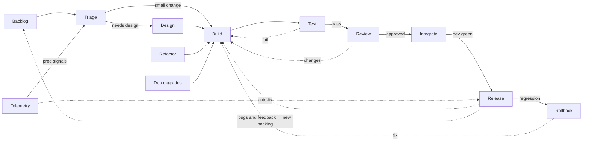

# 12. Target graph — the end point, not the next step

[← Index](00-index.md)

---

**Status:** Direction, not a plan. **Date:** 28-09-2026

This is the whole development lifecycle as one graph, where every node is a
loop. It's where the state machine (01–11) is heading. It is **not** what
gets built next. The next step is getting the basic lane
(Build → Review → Integrate → Release) working correctly under the
reducer: shadow mode, then enforcement, then the reducer owning labels
(07-build-phases.md, Phases 3–5). Nothing below starts until that lane is
trusted.

## The graph

Solid arrows are transitions. Dotted arrows are feedback / loop-backs.

Transcribed from a hand-drawn diagram (28-09-2026). The direction of the
two unlabelled or ambiguous dotted edges (Release → Build,
Telemetry → Release) is a best reading. Correct them here if they're wrong.

## What exists today

| Node | Today | Label / trigger |
|---|---|---|
| Backlog | Issues, created by hand | — |
| Triage | Nothing | — |
| Design | Partly `issue-discuss-loop` | `ai-discussing` |
| **Build** | `issue-build-loop` (includes its own testing) | `ai-ready` → `ai-generated` / `ai-blocked` |
| Test | Not a node; happens inside Build and in CI | — |
| **Review** | Human PR review; "changes" → `rework-loop` | `auto-reworking` |
| **Integrate** | `merge-flow` | `auto-merging` |
| **Release** | `auto-release-loop` | `auto-releasing` |
| Rollback | Nothing | — |
| Dep upgrades | `dependabot-rollup` exists, outside the graph | — |
| Refactor | Nothing as an issue loop | — |
| Telemetry | Nothing | — |

**Bold** is the basic lane: the part `graph/graph.ts` models today and the
part Phases 3–5 have to get right first.

## Edge types the current design doesn't cover

Most of the graph is more of what already works: a routine per node and
rules per arrow in `graph/graph.ts`. Five things aren't, and each needs a
design decision before its nodes are built.

1. **Edges that create an entity.** "Bugs and feedback → new backlog",
   Telemetry → Triage and Release → Backlog don't move an issue to a new
   state. They create a new issue. Every rule today is `(state, event) →`
   effect on the *same* issue, inside that issue's own DO. A spawn edge
   crosses DOs (issue A's event creates issue B), so it needs its own
   effect kind and a place to live.
2. **Event sources outside GitHub.** Telemetry and prod signals aren't
   webhooks. `graph/routines/from-routine.ts` is the pattern for a
   non-GitHub source (its own `from-*` slice feeding the same reducer), but
   a telemetry source needs deciding: what signal, from where, and who
   authenticates it.
3. **Test split from Build.** This is the first real agent split. It adds a
   Test → Build "fail" loop that needs a cap. It's the same mechanism as
   the rework cap (Phase 9), so build that first. Per
   05-technical-elements.md, a split costs a cold agent session per node,
   so split where a gate is needed, not everywhere.
4. **Many-issue nodes.** A release covers many issues. The
   `release <version>` issue convention handles Release today, but
   Rollback → Build ("fix") has to go from one release back to the specific
   issues or new fix issues. That overlaps with (1).
5. **Labels as state at this size.** About 13 states, plus sub-steps once
   nodes split. Either every state is a label (visible, noisy) or sub-steps
   live in DO storage (clean, but breaks "labels are authoritative",
   02-design-principles.md). Decide before the first split.

## Order, once the basic lane is trusted

A suggestion, not a commitment. Each step should be driven by what the
D1 log shows, per Phase 10.

1. Split Test out of Build (proves splitting on the busiest node).
2. Bring Dep upgrades into the graph (the loop already exists).
3. Triage and Design (front of the lane; mostly `issue-discuss-loop`).
4. Rollback, then Telemetry (they need edge types 1 and 2).
5. Refactor.

---

[← Index](00-index.md)
