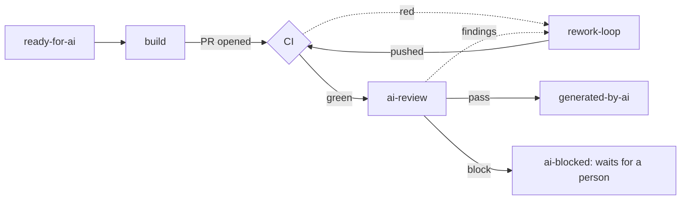

# 15. Agent splits — build/review and release

[← Index](00-index.md)

---

**Status:** Design agreed, not built. **Date:** 04-10-2026

Phase 10's first two splits. Phase 10 says split only where data points,
or where the split gives "a validation gate or a state worth seeing on the
board". Neither split comes from failure data; both come from two problems
seen in real runs:

- **Long sessions lose context.** Release routines have forgotten what
  they were doing part-way through. One long session doing many steps is
  the cause; short nodes with one goal each, with the Worker holding the
  state, are the fix.
- **The build loop's review isn't independent.** `issue-build-loop` runs
  `mcp-review` "at the orchestrator level" to make it independent, but it's
  the same session that dispatched the build and read its report.

Cost, per [05-technical-elements.md](05-technical-elements.md): each node
is a cold session that reloads the repo, issue and PR, so more context and
wall-clock in total. Accepted for these two.

## Split 1: build and review (first)

**Build** (`issue-build-loop`, one issue per fire, as cloud mode already is):
build, test locally, then an **in-context self-review subagent** (it has
the builder's context, and rereads the diff with a clear head), write the
decision log, open the PR, and stop. It no longer drives CI or runs
`mcp-review`.

**CI** is the Worker's. Red: fire `rework-loop` with the failing log, the
CI-fix path that exists for merge PRs today (`MAX_CI_FIX_ATTEMPTS`). Green:
add `ai-review` to the PR.

**Review** is a new routine on its own label, `ai-review`, on a **stronger
model than the builder**. Adversarial: it starts with nothing but the PR.

1. It forms its findings **without** reading the decision log.
2. It then checks each finding against the log. One that contradicts a
   logged decision is reported as a challenge to it ("challenges decision
   2: …"), not as a plain fix.
3. Outcome, as an agent-outcomes artifact, applied by the Worker:
   - **pass** → the issue gets `generated-by-ai`; the PR is ready for a
     person.
   - **findings** → `auto-rework`, with the findings in the comment.
   - **block** ("the approach is wrong") → `ai-blocked`, and it **waits for
     a person**. No automatic rebuild.

A person can add `ai-review` to any PR to (re-)run the review, e.g. after
editing it by hand. While it runs, the PR shows `ai-review`. This settles
[12-target-graph.md](12-target-graph.md)'s "labels as state" question for
this split: the sub-step is a label, visible on the board.

**Fixes are `rework-loop`'s**, the reviewer never fixes its own findings.
`rework-loop` reads the decision log, so it can weigh a challenge rather
than blindly undo a deliberate choice. Its push goes back through CI and
then `ai-review`.

**Caps.** Review rework rounds are counted separately for bots and people
(the transition's actor already says which), 3 each to start. Today's
`MAX_REVIEW_REWORKS` counts both together. A person re-adding
`auto-rework` from `ai-stuck` resets both counts, as now.

### The decision log and build log, in D1

Two logs per issue and PR, after the convention in Matt Brailsford's
[umbraco-claude-playbook](https://github.com/mattbrailsford/umbraco-claude-playbook)
(`DECISION-LOG.md`, `BUILD-LOG.md` and `decision-review`, used on
`umbraco/Umbraco.AI`), but kept in D1 rather than files:

- **Decision log:** each choice the issue left open, one short dated entry
  with why (and what was rejected), tagged with his four categories:
  *assumption*, *deviation*, *workaround*, *judgment call*.
- **Build log:** what each node did and verified: commit, tests run and
  their counts, review round and verdict, and what wasn't verified.

**Why D1.** `transitions` is already each issue's build history (every
label change and fire, with its actor). Putting decisions and verification
beside it gives one timeline on the dashboard: labelled → decided X because
Y → tests 42/42 → review round 1 FAIL → rework → PASS. Entries are rows,
so writers never overwrite each other, and they can be queried across
issues ("every workaround this month"), which is the data Phase 10 says
splits should follow. Writing doesn't push a commit, so the reviewer can
log its verdicts without restarting CI and review. It's our own schema, so
no GitHub lock-in.

**Who writes what:**

| Node | Decision log | Build log |
|---|---|---|
| build | its decisions (the self-review subagent's go through it) | its entry |
| `ai-review` | reads it, after forming its findings | its verdict, round and findings |
| `rework-loop` | reads it; appends its own | its entry |
| Worker | — | — (`transitions` stays its log) |

**Access: an MCP endpoint on the Worker.** Tools to append an entry and to
read an issue's log. Each fire carries a short-lived token the Worker mints
for that one issue/PR and that routine: append-only (no edit, no delete),
entries capped at a few KB, so a routine that has read hostile text (issue
bodies, PR comments) can only add short entries to its own issue. Writes
are best effort: a routine never stops because the Worker is unreachable.

**For people:**
- The dashboard shows the merged timeline (reading summaries, not the whole
  log, per the D1 read budget).
- The PR description gets a `decision-review`-style digest: only the
  entries a person should look at, ranked, with a recommended action.
- On merge, the Worker exports the issue's logs as the permanent copy
  (D1 belongs to this deployment; `tofu destroy` removes it). Where the
  export goes, a file in the repo or the PR itself, is still open.

**Repos that already use the playbook** (a `docs/plans/<feature>/` folder)
keep their files; the routines read them as well as D1.

**Prerequisite: Workers Paid.** The plan is per Cloudflare account and
covers the Worker, Durable Objects and D1 together. Since 01-09-2026 the
free plan fails D1 queries outright once the daily row cap is hit, which
would stop the orchestrator, not just the logs. Size isn't a limit: about
50 KB per busy issue against 500 MB (free) or 10 GB (paid) per database.

## Split 2: release

Most of `auto-release-loop` (229 lines, seven steps) is mechanical work
done by an agent, and its long tail is where it loses track.

- **Stays an agent:** prepare (cut `release/<version>`, bump, changelog,
  PR), fix CI, and the pre-publish review (`release-reviewer`, already a
  separate read-only agent; it can block).
- **Becomes deterministic code:** merge to `main`, tag and GitHub Release
  (`release-tag.yml` does this already), the Slack post, sync `main` back
  to `dev` (`sync-main-to-dev.yml` exists), comment and close the issue.

**Open: where the deterministic part runs.** The Worker (needs write on
`main` and tags, much more than it has today, but vendor-neutral) or
Actions in each target repo (every repo needs the workflows). Explore
before building split 2.

## Rollout

Sandbox first (`hifi-phil/mcp-ops-e2e-testing`): the e2e suite gains
scenarios for review pass, findings, block, a person re-running
`ai-review`, and the split counts, with stub agents as for the other
loops. Then umbraco-mcp-ops; the umbraco repos inherit it once onboarded.

## Still to decide while building

- The review routine's and skill's name (`mcp-review` is a skill today;
  content repos need a reviewer too).
- New outcome artifacts (`review_passed`, `review_findings`,
  `review_blocked`) and their graph rules; `ai-review` added to
  `LABELS`.
- Whether a CI-fix push on a PR already in `ai-review` restarts the
  review.
- Skill changes: `issue-build-loop` stops at PR open; every node reads and
  appends to the logs through the MCP.
- The logs' schema (one table or two), the MCP's tools, and how the fire
  token reaches the routine.
- Where the on-merge export goes.
- Whether the orchestrator moves to an Umbraco-owned Cloudflare account
  (not the shared production one) before going paid.

---

[← Index](00-index.md)
