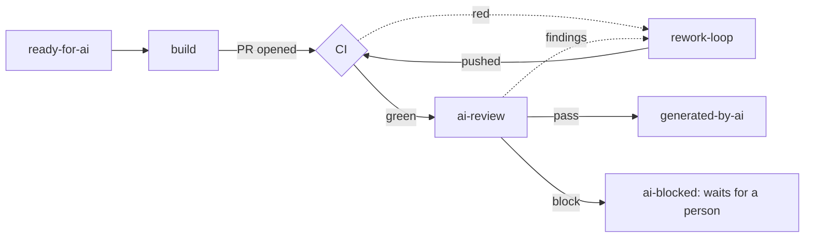

# 15. Agent splits — build/review and release

[← Index](00-index.md)

---

**Status:** Design agreed, not built. **Date:** 04-10-2026

## Summary

- **Build and review become separate routines.** The build routine stops
  once the PR is open. A new `ai-review` routine reviews the PR with fresh
  eyes. `rework-loop` makes the fixes.
- **Every routine records its decisions and what it verified** in two
  logs, kept in D1 next to the label history.
- **The release routine is reduced to the parts that need judgement.**
  The mechanical steps after the review become plain code.
- **Order:** build/review first, in the sandbox. Release second.

## Why split

Phase 10 says split a node only when data points at it, or when the split
gives "a validation gate or a state worth seeing on the board". These two
splits don't come from failure data. They come from two problems seen in
real runs.

1. **Long sessions lose context.** Release routines have forgotten what
   they were doing part-way through. Short routines with one goal each,
   with the Worker holding the state, avoid that.
2. **The build loop's review isn't independent.** `issue-build-loop` runs
   `mcp-review` itself. That's the same session that dispatched the build
   and read its report, so the review shares the builder's view.

**The cost:** each routine starts cold and reloads the repo, the issue and
the PR. That means more tokens and more wall-clock time overall
([05-technical-elements.md](05-technical-elements.md)). It's accepted for
these two.

## Split 1: build and review

### Build

`issue-build-loop` handles one issue per fire, as its cloud mode already
does. It:

1. builds the change and tests it locally;
2. runs a **self-review subagent** that has the builder's context and
   rereads the diff with a clear head;
3. writes its decisions and build entry to the logs (below);
4. opens the PR, and stops.

It no longer drives CI or runs `mcp-review`.

### CI

The Worker watches CI, not the build routine.

- **Red:** the Worker fires `rework-loop` with the failing log. This is the
  CI-fix path merge PRs already use (`MAX_CI_FIX_ATTEMPTS`).
- **Green:** the Worker adds `ai-review` to the PR.

### Review

A new routine on its own label, `ai-review`, running on a **stronger model
than the builder**. It's adversarial: it starts with nothing but the PR.

1. It forms its findings **without** reading the decision log.
2. It then checks each finding against the log. A finding that contradicts
   a logged decision is reported as a challenge to that decision
   ("challenges decision 2: …"), not as a plain fix.
3. It reports one of three outcomes, which the Worker applies:

| Outcome | What happens |
|---|---|
| **pass** | The issue gets `generated-by-ai`. The PR is ready for a person. |
| **findings** | `auto-rework`, with the findings in the comment. |
| **block** ("the approach is wrong") | `ai-blocked`. It **waits for a person**; nothing rebuilds automatically. |

The PR shows `ai-review` while the review runs. A person can add the label
to any PR to run the review again, for example after editing it by hand.
This answers [12-target-graph.md](12-target-graph.md)'s "labels as state"
question for this split: the step is a label, visible on the board.

### Fixes

**`rework-loop` makes every fix.** The reviewer never fixes its own
findings. `rework-loop` reads the decision log, so it can weigh a challenge
instead of blindly undoing a deliberate choice. Its push goes back through
CI, then `ai-review`.

### Caps

Review rework rounds are counted **separately for bots and for people**,
3 each to start. Each transition already records who made it, so the two
can be told apart. Today `MAX_REVIEW_REWORKS` counts both together. A
person re-adding `auto-rework` from `ai-stuck` resets both counts, as now.

## The decision log and build log

### What they are

This follows Matt Brailsford's
[umbraco-claude-playbook](https://github.com/mattbrailsford/umbraco-claude-playbook)
(`DECISION-LOG.md`, `BUILD-LOG.md` and `decision-review`, in use on
`umbraco/Umbraco.AI`). The difference is that the entries live in D1, not
in files.

- **Decision log:** each choice the issue didn't settle. One short, dated
  entry: what was decided, why, and what was rejected. Each entry is tagged
  with one of his four categories: *assumption*, *deviation*, *workaround*
  or *judgment call*.
- **Build log:** what each routine did and checked: the commit, the tests
  run and their counts, the review round and verdict, and anything it
  didn't verify.

### Why D1

- **One timeline.** `transitions` already records every label change and
  fire for an issue, with who caused it. With decisions and checks next to
  it, the dashboard can show the whole story: labelled → decided X because
  Y → tests 42/42 → review round 1 FAIL → rework → PASS.
- **No overwrites.** Every entry is its own row, so two writers can't
  overwrite each other.
- **Queryable.** "Every workaround this month" is a single query. That's
  the data Phase 10 says future splits should follow.
- **The reviewer can write.** Writing to D1 doesn't push a commit, so it
  doesn't restart CI and the review.
- **No lock-in.** It's our own schema, not something tied to GitHub.

### Who writes what

| Routine | Decision log | Build log |
|---|---|---|
| build | Writes its decisions, including the self-review subagent's | Writes its entry |
| `ai-review` | Reads it, after forming its findings | Writes its verdict, round and findings |
| `rework-loop` | Reads it, and adds its own decisions | Writes its entry |
| Worker | — | — (`transitions` is its log) |

### How routines reach it

Through an **MCP endpoint on the Worker**, with tools to add an entry and
to read an issue's log.

- **Scoped tokens.** Each fire carries a short-lived token, issued by the
  Worker, for that one issue or PR and that one routine.
- **Add-only.** A token can add entries but not edit or delete them.
  Entries are capped at a few KB. A routine that has read hostile text in
  an issue or a PR comment can, at worst, add short entries to its own
  issue.
- **Best effort.** A routine never stops because the Worker can't be
  reached.

### What people see

- **Dashboard:** the merged timeline. It reads summaries, not the whole
  log, to stay within the D1 read budget.
- **PR description:** a short summary in the style of `decision-review`.
  It lists only the entries a person should look at, ranked, each with a
  recommended action.
- **Permanent copy:** when the PR merges, the Worker exports the issue's
  logs. D1 belongs to this deployment and `tofu destroy` removes it.
  Whether the export goes into the repo as a file or onto the PR is still
  open.

Repos that already use the playbook, with a `docs/plans/<feature>/` folder,
keep their files. The routines read those as well as D1.

### Prerequisite: Workers Paid

- **It's an account plan.** Workers Paid applies to the whole Cloudflare
  account and covers the Worker, the Durable Objects and D1 together.
- **The free plan fails hard.** Since 01-09-2026, D1 queries fail outright
  once the daily row cap is hit. That would stop the orchestrator, not just
  the logs.
- **Size isn't the issue.** A busy issue is about 50 KB of log entries. A
  database holds 500 MB on the free plan and 10 GB on paid.

## Split 2: release

Most of `auto-release-loop` (229 lines, seven steps) is mechanical work
done by an agent, and the end of the run is where it loses track.

| Stays an agent | Becomes plain code |
|---|---|
| Prepare: cut `release/<version>`, bump the version, write the changelog, open the PR | Merge to `main` |
| Fix CI | Tag and GitHub Release (`release-tag.yml` already does this) |
| Pre-publish review (`release-reviewer`, already a separate read-only agent; it can block) | Slack post |
| | Sync `main` back to `dev` (`sync-main-to-dev.yml` exists) |
| | Comment on and close the issue |

**Open: where the plain code runs.** Two options:

- **The Worker.** Vendor-neutral, but it needs write access to `main` and
  tags, much more than it has today.
- **Actions in each target repo.** Every repo needs the workflows.

This needs exploring before split 2 is built.

## Rollout

1. **Sandbox** (`hifi-phil/mcp-ops-e2e-testing`). The e2e suite gains
   scenarios for:
   - review pass, findings and block;
   - a person re-running `ai-review`;
   - the separate bot and human counts.

   Stub agents stand in for the routines, as for the other loops.
2. **umbraco-mcp-ops.**
3. **The umbraco repos**, once they're onboarded.

## Still to decide while building

**Review routine**
- The name of the routine and its skill. `mcp-review` is a skill today,
  and content repos need a reviewer too.
- The new outcomes (`review_passed`, `review_findings`, `review_blocked`),
  their rules in the graph, and `ai-review` in `LABELS`.
- Whether a CI-fix push on a PR already in `ai-review` restarts the review.

**Logs**
- The schema: one table or two.
- The MCP's tools, and how the fire token reaches the routine.
- Where the export goes when a PR merges.

**Skills**
- `issue-build-loop` stops once the PR is open.
- Every routine reads and writes the logs through the MCP.

**Account**
- Whether the orchestrator moves to an Umbraco-owned Cloudflare account
  (not the shared production one) before going paid.

---

[← Index](00-index.md)
