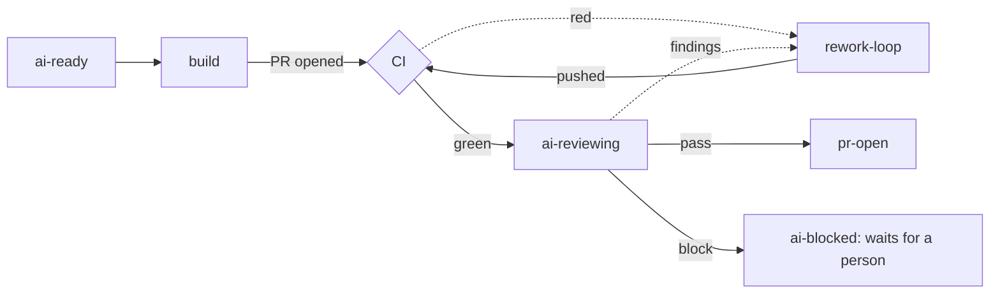

# 15. Agent splits — build/review and release

[← Index](00-index.md)

---

**Status:** Design agreed, not built. **Date:** 04-10-2026

## Summary

- **Build and review become separate routines.** The build routine stops
  once the PR is open. A new `ai-reviewing` routine reviews the PR with fresh
  eyes. `rework-loop` makes the fixes.
- **Every routine records its decisions and what it verified** in two
  logs, kept in D1 next to the label history.
- **The release routine is reduced to the parts that need judgement.**
  The mechanical steps after the review become plain code.
- **Order:** build/review first, in the sandbox. Release second.

## Why split

Phase 10 says split a node only when data points at it, or when the split
gives "a validation gate or a state worth seeing on the board". These two
splits don't come from failure data. They come from two problems seen in
real runs.

1. **Long sessions lose context.** Release routines have forgotten what
   they were doing part-way through. Short routines with one goal each,
   with the Worker holding the state, avoid that.
2. **The build loop's review isn't independent.** `issue-build-loop` runs
   `mcp-review` itself. That's the same session that dispatched the build
   and read its report, so the review shares the builder's view.

**The cost:** each routine starts cold and reloads the repo, the issue and
the PR. That means more tokens and more wall-clock time overall
([05-technical-elements.md](05-technical-elements.md)). It's accepted for
these two.

## Split 1: build and review

### Build

`issue-build-loop` handles one issue per fire, as its cloud mode already
does. It:

1. builds the change and tests it locally;
2. reviews it with `mcp-review` (Anthropic's review agents, as it always
   has), from its top-level session, and fixes what that finds;
3. writes its decisions and build entry to the logs ([16-work-log.md](16-work-log.md));
4. adds `ai-reviewing` to the PR, and stops.

It no longer drives CI. That's the same whether or not the Worker
orchestrates the repo (decided 07-10-2026); only who swaps the issue's labels
differs, as for every loop.

### CI

The Worker watches CI, not the build routine. `ai-reviewing` goes on when the
PR opens, but the review only fires once CI has finished. The Worker reads
the PR's checks when the label is added and each time a check suite
finishes, the same live re-check `auto-merging` uses.

- **Still running, or not started:** wait for the next check suite.
- **Red:** `ai-reviewing` is swapped for `auto-reworking` and the Worker fires
  `rework-loop` with the failing checks. Its push brings `ai-reviewing` back.
  Capped at `MAX_CI_FIX_ATTEMPTS`, then `ai-stuck`.
- **Green:** the Worker fires `review-loop`.

### Review

A new routine, `review-loop`, on its own label, `ai-reviewing`, running on a
**stronger model than the builder**. It's adversarial: it starts with nothing but the PR.

1. It forms its findings **without** reading the decision log.
2. It then checks each finding against the log. A finding that contradicts
   a logged decision is reported as a challenge to that decision
   ("challenges decision 2: …"), not as a plain fix.
3. It reports one of three outcomes, which the Worker applies:

| Outcome | What happens |
|---|---|
| **pass** | `ai-reviewing` is swapped for `ready-for-review`: the PR is waiting for a person, who approves the merge (`auto-merging`), asks for changes (`auto-reworking`) or runs the review again (`ai-reviewing`), and the label comes off. |
| **findings** | `auto-reworking`, with the findings in the comment. |
| **block** ("the approach is wrong") | `ai-blocked`. It **waits for a person**; nothing rebuilds automatically. |

**The review's state lives on the PR, not the issue.** The issue still gets
`pr-open` when the build opens the PR, as today. Changing the
issue's label from a verdict on the PR would be the first effect that
crosses from one issue to another, which the design doesn't cover yet
([12-target-graph.md](12-target-graph.md), edge type 1). So
`pr-open` means "the build opened a PR", and whether that PR passed
review is read from the PR.

The PR shows `ai-reviewing` while it waits for CI and while the review runs. A
person can add the label to any PR to run the review again, for example
after editing it by hand, or after a block.
This answers [12-target-graph.md](12-target-graph.md)'s "labels as state"
question for this split: the step is a label, visible on the board.

### Fixes

**`rework-loop` makes every fix.** The reviewer never fixes its own
findings. `rework-loop` reads the decision log, so it can weigh a challenge
instead of blindly undoing a deliberate choice. Its push goes back through
CI, then `ai-reviewing`.

### Caps

Review rework rounds are counted **separately for bots and for people**,
3 each to start. Each transition already records who made it, so the two
can be told apart. Today `MAX_REVIEW_REWORKS` counts both together. A
person re-adding `auto-reworking` from `ai-stuck` resets both counts, as now.

## The decision log and build log

Every routine records its decisions and what it verified, in D1 next to the
label history. The design and the plan are in their own document:
[16-work-log.md](16-work-log.md).

## Split 2: release

Built and shipped in 2.1.0: before (`auto-release-loop` prepares and
reviews), the merge (the Worker, as its App), after (`release-publish`). The
design, the diagrams and the labels along the way are in their own document:
[17-release-flow.md](17-release-flow.md).

## Rollout

1. **Sandbox** (`hifi-phil/mcp-ops-e2e-testing`). The e2e suite gains
   scenarios for:
   - review pass, findings and block;
   - a person re-running `ai-reviewing`;
   - the separate bot and human counts.

   Stub agents stand in for the routines, as for the other loops.
2. **umbraco-mcp-ops.**
3. **The umbraco repos**, once they're onboarded.

## Still to decide while building

**Review routine**
- **Settled (07-10-2026): the skill behind `review-loop`** is its own skill,
  `review-loop`, which runs `mcp-review` in report-only mode (it fits both
  repo shapes) with the reviewers on `opus`. A repo's `CLAUDE.md` can name a
  different reviewer skill.

Settled in the graph and Worker change: the routine is `review-loop`; its
outcomes are `review_passed`, `review_findings` (with a count) and
`review_blocked` (with a reason); and any push from a rework started under
`ai-reviewing`, a CI fix or the review's findings, goes back to `ai-reviewing`
and is reviewed again once its CI is green.

**Logs:** see [16-work-log.md](16-work-log.md).

**Skills** (part 3, built 07-10-2026, except the logs)
- `issue-build-loop` reviews its PR with `mcp-review`, adds `ai-reviewing`
  and stops, orchestrated or not. It no longer drives CI.
- Every routine reads and writes the logs through `log-entry.sh` (the `work-log` skill). *(Part 2, not
  built yet.)*
- **`review-loop` posts its findings as a real PR review**, with inline
  comments on the lines concerned. `rework-loop` only reads a PR's reviews
  and review comments (its Step 1), so findings left in an ordinary
  comment would look like "nothing actionable": it would clear the label
  without fixing anything, and three such rounds end in `ai-stuck`.
  - GitHub won't let a PR's author request changes on their own PR. If the
    routines act as the account that opened it, the review is a plain
    "comment" review. That still creates inline threads, which
    `rework-loop` reads.
  - The outcome marker for the Worker goes in a separate comment (the
    Worker reads comments), not the review's body.
- **`rework-loop` reads the decision log**, so it can weigh a finding that
  challenges a deliberate choice instead of undoing it. *(Part 2.)*
- **`rework-loop` rereads the issue**, so a fix doesn't drift from what the
  issue asked for. A finding it judges wrong gets a reply on its thread,
  not a change.
- The e2e stub's `review-loop` posts a real PR review for findings and a
  block, and its `rework-loop` pushes nothing when it finds no review to
  act on.

**Account**
- Whether the orchestrator moves to an Umbraco-owned Cloudflare account
  (not the shared production one), if and when it goes paid.

---

[← Index](00-index.md)
