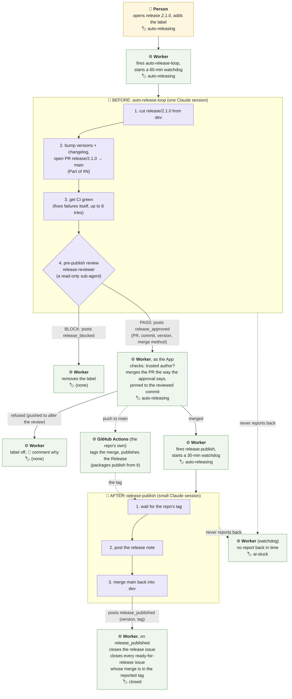
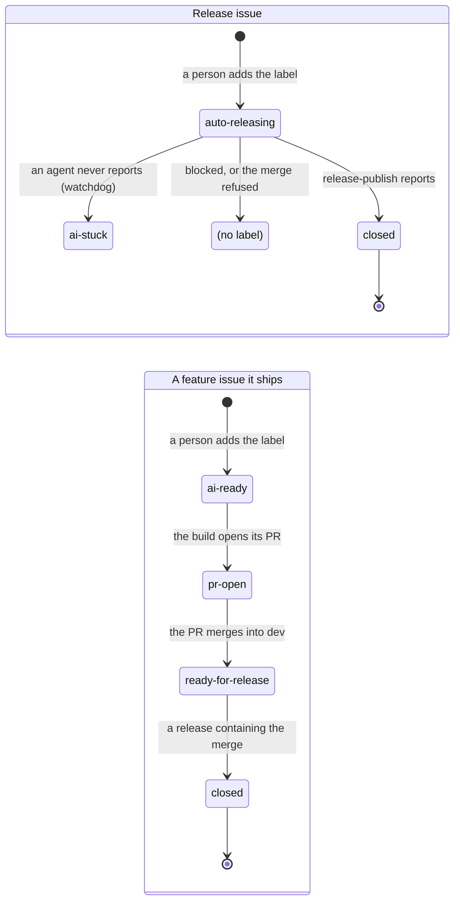

# 17. The release flow

[← Index](00-index.md)

---

**Status:** Built, released in 2.1.0 (06-10-2026). **Date:** 06-10-2026

How an orchestrated release runs: before (an agent prepares and reviews),
the merge (the Worker, as its GitHub App), after (a small agent publishes).
The second split in [15-agent-splits.md](15-agent-splits.md), where the
reasoning for splitting is.

---

Most of `auto-release-loop` (229 lines, seven steps) is mechanical work
done by an agent, and the end of the run is where it loses track.

| Before (🤖 `auto-release-loop`) | Plain code | After (🤖 `release-publish`) |
|---|---|---|
| Prepare: cut `release/<version>`, bump the version, write the changelog, open the PR | Merge to `main` (the Worker, as the App) | Wait for the tag |
| Fix CI | Tag and GitHub Release (the repo's `release-tag.yml`) | Post the release note |
| Pre-publish review (`release-reviewer`, a read-only sub-agent; it can block) | Close the issue, hand off `released` (the Worker) | Merge `main` back into `dev` |

**Settled (06-10-2026): before, merge, after.** Project knowledge stays in
skills (composable and swappable, shared across the MCP repos rather than
copied into each one); the orchestrator holds no project conventions, and
only does what's the same for every project: the merge, as its GitHub App.

| Part | Who | What | Project-specific? |
|---|---|---|---|
| **Before** | 🤖 `auto-release-loop` | prepare, CI green, pre-publish review → `release_approved` (PR, reviewed commit, version, merge method) | yes, through the skills it composes |
| **Merge** | ⚙ the Worker, as the App | merges the way the approval says (`merge`, `squash` or `rebase`), pinned to the reviewed commit | no: the project's choice arrives as data |
| **After** | 🤖 `release-publish` (skinny) | waits for the repo's tag, posts the release note, merges `main` back into `dev` → `release_published` (version, tag) | yes: a repo's `CLAUDE.md` can name its own publish skill |

- **Tagging** (and the GitHub Release, and publishing packages) stays with
  each repo's own GitHub Actions; neither agent ever tags.
- **The Worker checks only what's universal:** the approval comes from its
  own App or someone with write access, and the merge is pinned to the
  reviewed commit (GitHub enforces it). No branch names, no tag format: the
  tag comes in `release_published`, as the repo named it.
- **A refused merge** is handled like a block (label off, with the reason);
  a PR already merged at the reviewed commit (a redelivery) counts as done.
- **The after part is fired by the Worker** straight after its own merge
  (`release_merged`), watched for 30 minutes. In orchestrated mode the
  release PR says "Part of #N", not "Closes #N": on the default branch
  "Closes" would close the issue at the merge, before `release-publish` ran.
- `release_published` closes the release issue and hands `released`, with
  the tag, to the issues waiting for it.

## The release, end to end

Two agents, each one Claude session (the 🤖 boxes): `auto-release-loop`
(before), which starts when the Worker fires it and ends when it reports
`release_approved` or `release_blocked`, with `release-reviewer`, a
read-only sub-agent inside it that only judges; and `release-publish`
(after), small, fired by the Worker once it has merged. Everything else is
deterministic: the Worker and the repo's own GitHub Actions. If either
session never reports, the watchdog moves the issue to `ai-stuck`.

## The labels along the way

The release PR itself carries no tracked label: the Worker merges it
directly.

---

[← Index](00-index.md)
