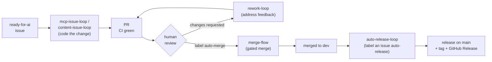
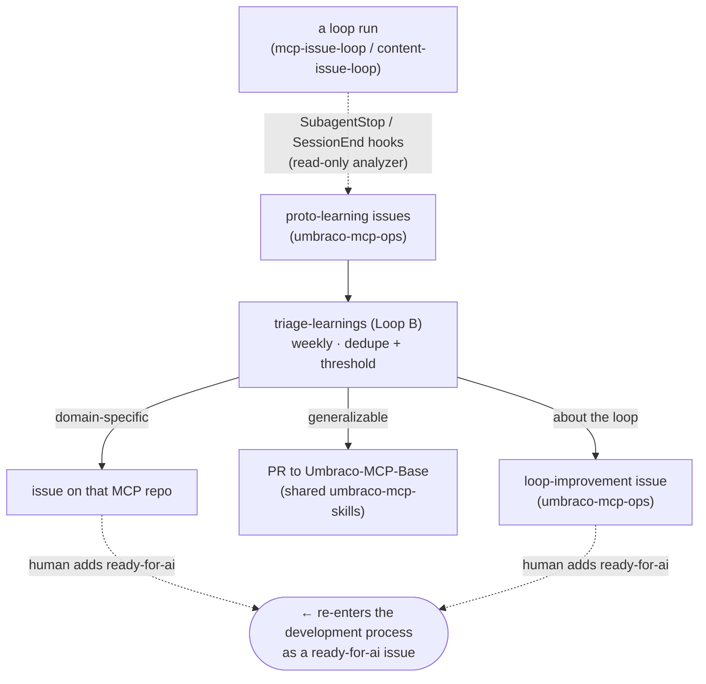
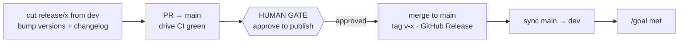

# The self-learning issue system — setup & operations

This repo hosts a set of `/goal`-driven **loops** that work the Umbraco MCP repos
autonomously *and* feed their own improvement back in. This guide is the single
place that explains **how it fits together**, **how to set it up**, and **how to
use it**. Each loop also self-documents in its own `SKILL.md`; this is the map.

## 1. The development process

How one unit of work flows from an issue to a shipped release — the forward path:



**Human gates on this path:** the **`auto-merge` label** before merge (`merge-flow`
won't merge a PR that isn't labelled + green + clean), and the **`auto-release` label**
to start a release (`auto-release-loop` then ships it once CI is green — the deliberate
label is the decision; there's no separate publish pause). The loops automate the
mistake-prone mechanics; you keep the "ship this" decisions.

## 2. The self-learning loop

What the *same* loop runs emit as a byproduct, and how it compounds back into the
development process above:



**The compounding gate:** a proto-learning or loop-improvement issue only re-enters
the development process when a **human adds `ready-for-ai`** — nothing self-triggers.
Generalizable lessons instead become a drafted PR to the shared skills, so every MCP
repo benefits next time.

## The loops at a glance

| Loop | Plugin | What it does | Where it runs | Trigger |
|------|--------|--------------|---------------|---------|
| `mcp-issue-loop` | mcp-issue-loop | Works `ready-for-ai` issues on an **MCP** repo → CI-green PR. *Local:* worktrees + parallel subagents + local tests + review loop. *Cloud:* one session/issue, CI-driven (no local Umbraco), stop at green PR | Dev machine **or** cloud routine (Issue: Labeled `ready-for-ai`) | label `ready-for-ai` |
| `rework-loop` | mcp-issue-loop | Address a PR's review feedback → re-green CI → re-request review (never merges) | Cloud routine (PR-review event) or local | reviewer requests changes |
| `content-issue-loop` | mcp-issue-loop | Same, for repos **without** the toolchain (this repo, `Umbraco-MCP-Base`, docs) | Dev machine or runner | "work the ready ops issues" |
| capture hooks | mcp-issue-loop | After each subagent, analyze the transcript and file `proto-learning` issues | Wherever the loop runs | automatic (`SubagentStop`/`SessionEnd`) |
| `triage-learnings` | mcp-issue-loop | Route proto-learnings → MCP-repo issue / shared-skills PR / loop-improvement issue | Web runner (scheduled) | "triage the learnings" |
| `merge-flow` | merge-flow | Merge PRs labelled `auto-merge` once green + conflict-free (the label is the approval) | Cloud routine (weekdays) | label `auto-merge` |
| `auto-release-loop` | release-flow | Cut branch, drive CI green, publish + tag + Release, sync `dev` — CI-gated, no approval pause | Cloud routine (Issue: Labeled) | label an issue `auto-release` |

Not a loop, but every loop above depends on it: **`github-ops`** — the shared how-to
for GitHub work in both environments (`gh` CLI locally, the GitHub MCP server on the
web). The loops defer all GitHub commands/tools to it.

## Setup

### 1. Install the plugins

Inside Claude Code:

```
/plugin marketplace add hifi-phil/umbraco-mcp-ops
/plugin install mcp-issue-loop@umbraco-mcp-ops
/plugin install merge-flow@umbraco-mcp-ops
/plugin install release-flow@umbraco-mcp-ops
/plugin install github-ops@umbraco-mcp-ops
/plugin install dependabot-rollup@umbraco-mcp-ops
/reload-plugins
```

Re-run the install (or `/plugin` update) + `/reload-plugins` after a version bump.

This `/plugin install` is **local only** (a dev machine, or a Desktop scheduled task —
the plugin is on disk). Cloud sessions/routines don't read your machine's plugins.

### 1b. Cloud / web delivery — the `cloud-skill-sync` setup script

Cloud routines load skills from the session's skills dir. Deliver them there with the
[`cloud-skill-sync`](../scripts/cloud-skill-sync/) **environment setup script**: paste
[`scripts/cloud-skill-sync/cloud-skill-sync.sh`](../scripts/cloud-skill-sync/cloud-skill-sync.sh)
into the cloud environment's **Setup script** field. On build it clones this (public)
repo and copies the listed skills into `$HOME/.claude/skills` **and every plugin agent
(e.g. `release-reviewer`) into `$HOME/.claude/agents`**, so any routine in that
environment can invoke the skills and spawn the agents.

- **No per-repo marketplace marker, no committed skill files, no manual upload, no
  token** — the public clone is anonymous, and the runner's egress proxy stays free for
  the routine's own GitHub work.
- Include at least **`github-ops`** (every loop references it by name) plus whichever
  loops you want in cloud — e.g. **`triage-learnings`**, **`merge-flow`**,
  **`rework-loop`**, **`mcp-issue-loop`** (edit the script's `SKILLS` list).
  (**`dependabot-rollup` is local-only** — the Claude GitHub App can't read Dependabot
  alerts, so it can't run as a cloud routine.) `mcp-issue-loop` runs in cloud in its **cloud mode** (one session per issue,
  CI as the test gate — no local Umbraco); its **local mode** (worktrees + `test:all` +
  the review loop + capture hooks) is dev-machine-only.
- **Refresh after a skill change:** bump `VERSION` in the script and re-save (the env
  snapshot is cached ~7 days; changing the source repo alone doesn't bust it). The repo
  stays the source of truth.

### 2. Labels

The system is label-driven. Create the labels on the repos that need them:

| Label | On which repo(s) | Purpose |
|-------|------------------|---------|
| `ready-for-ai` | every MCP repo (and any repo a loop should work) | The only gate a loop acts on |
| `generated-by-ai` | every MCP repo a loop works | Set by `mcp-issue-loop` on completion (replaces `ready-for-ai` when the CI-green PR opens) |
| `proto-learning` | `hifi-phil/umbraco-mcp-ops` | Capture inbox |
| `triaged` | `hifi-phil/umbraco-mcp-ops` | Loop B routed it to a PR (skip next run) |
| `loop-improvement` | `hifi-phil/umbraco-mcp-ops` | A change to the loop itself, promoted from a learning |
| `auto-merge` | any repo where `merge-flow` runs | Merge me once approved + green |

```bash
# ops repo (inbox + loop bookkeeping)
gh label create ready-for-ai     --repo hifi-phil/umbraco-mcp-ops --color 0e8a16
gh label create proto-learning   --repo hifi-phil/umbraco-mcp-ops --color c5def5
gh label create triaged          --repo hifi-phil/umbraco-mcp-ops --color ededed
gh label create loop-improvement --repo hifi-phil/umbraco-mcp-ops --color 5319e7
gh label create auto-merge       --repo hifi-phil/umbraco-mcp-ops --color 0e8a16

# each MCP repo you want the loop to work
gh label create ready-for-ai    --repo umbraco/<MCP-repo> --color 0e8a16
gh label create generated-by-ai --repo umbraco/<MCP-repo> --color c5def5
gh label create auto-merge      --repo umbraco/<MCP-repo> --color 0e8a16
```

(The ops-repo labels already exist; the per-MCP-repo ones are created as you enable
the loop on each.)

### 3. GitHub access & permissions

GitHub work follows the **`github-ops`** skill, which uses the mechanism the
environment offers:

- **Locally:** the `gh` CLI + `git` — your `gh` login covers everything, nothing to
  configure.
- **Claude web / scheduled routines:** the **GitHub MCP server** (`mcp__github__*`) —
  `gh` is not available there. Auth is the MCP server's connected GitHub App; no token
  to paste.

For the scheduled routines to act, that **connected app must grant, across both
`hifi-phil/umbraco-mcp-ops` and the `umbraco/*` repos:**

- `issues: write` — triage creates/labels/closes issues
- `pull_requests: write` — triage/merge-flow open and merge PRs
- `contents: write` — create branches, push files

`branch-housekeeping` (a bash script, not a Claude skill) is the exception — it calls
the REST API with `curl` + a proxy-injected token and only needs `contents: write` +
`pull_requests: read`. The Claude-driven routines need the broader grant above —
confirm/expand it before scheduling (a GitHub-App-installation decision, not a
per-user token).

## Using the loops

- **Complete issues:** label issues `ready-for-ai`, then run `mcp-issue-loop`
  (MCP repos) or `content-issue-loop` (ops/base/docs). Each opens a PR and waits
  for your review. Capture is automatic.
- **Merge:** approve a PR and add `auto-merge`; `merge-flow` merges it once CI is
  green and it's conflict-free (it never merges on a red or unapproved PR).
- **Triage learnings:** run `triage-learnings` (or let the weekly routine do it).
  It files issues to owning repos and drafts PRs only for the shared skills. You
  then decide which of its issues to promote to `ready-for-ai`.
- **Release:** open an issue titled `release <version>` and label it `auto-release`.
  `auto-release-loop` cuts the branch, bumps, drives CI green, then (CI is the gate —
  no approval pause) publishes + tags + Release and syncs `main`→`dev`, pushing you at
  start + completion.

## Runtime: dev machine vs web runner

- **Dev machine:** `gh` available; `mcp-issue-loop` *must* run here (Umbraco
  toolchain, worktree DB hooks, `npm run test:all`).
- **Web runner (event/scheduled):** `gh` is **absent** — routines do GitHub work through
  the **GitHub MCP server** (`mcp__github__*`), per `github-ops`. `triage-learnings`,
  `merge-flow`, and `auto-release-loop` run here. (The bash `scripts/` — e.g.
  `branch-housekeeping` — are the separate case that uses `curl`/REST directly.)

## Scheduled routines

Full inventory of cross-repo routines in this repo:

| Routine | Cadence | Status |
|---------|---------|--------|
| `branch-housekeeping` (`scripts/`) | weekly | **live** |
| `merge-flow` | on `auto-merge` label (event) | **to wire** |
| `auto-release-loop` | on `auto-release` label (event) | **to wire** |
| `dependabot-rollup` (skill) | weekly | **local-only** (cloud impossible — Claude GitHub App can't read Dependabot alerts) |
| `triage-learnings` | weekly | **to wire** |

`mcp-issue-loop` and `content-issue-loop` are human-initiated and not scheduled.
`auto-release-loop` is **event-triggered** (a routine on Issue: Labeled → `auto-release`),
not on a cron. The web routines do GitHub work via the GitHub MCP server (see
`github-ops`); `branch-housekeeping` is the bash/`curl` exception.

Wiring a cloud routine is two steps: (1) ensure the environment's **setup script**
delivers the skills it needs — the [`cloud-skill-sync`](../scripts/cloud-skill-sync/)
script, with at least `github-ops` plus the loop's own skill in its `SKILLS` list (§1b);
(2) **create the routine** pointing at the target repo with a prompt that invokes the
skill, e.g. `Run /merge-flow` for the merge loop. Cloud runs off the
skills delivered by the setup script, not `/plugin install`. (`dependabot-rollup` is the
exception — it's local-only; see §1b.)

## 3. Release-loop lifecycle (detail)



The `/goal` is not met until `dev` is synced — the step manual releases most often
forget.
