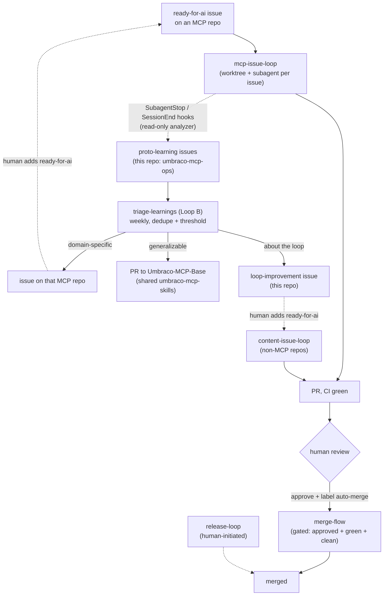
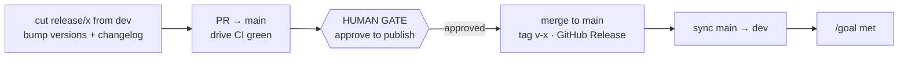

# The self-learning issue system — setup & operations

This repo hosts a set of `/goal`-driven **loops** that work the Umbraco MCP repos
autonomously *and* feed their own improvement back in. This guide is the single
place that explains **how it fits together**, **how to set it up**, and **how to
use it**. Each loop also self-documents in its own `SKILL.md`; this is the map.

## The flywheel



**Two human gates, everywhere:** (1) a proto-learning or loop-improvement issue
only re-enters a loop when a **human adds `ready-for-ai`**; (2) every PR is merged
only after **human approval** (via `merge-flow`), and every release **pauses for
human approval before publish** (via `release-loop`). The loops automate the
mistake-prone mechanics; humans keep the "act on this / ship this" decisions.

## The loops at a glance

| Loop | Plugin | What it does | Where it runs | Trigger |
|------|--------|--------------|---------------|---------|
| `mcp-issue-loop` | mcp-issue-loop | Works `ready-for-ai` issues on an **MCP** repo → CI-green PR → review loop | Dev machine (needs Umbraco toolchain) | "work the ready issues" |
| `content-issue-loop` | mcp-issue-loop | Same, for repos **without** the toolchain (this repo, `Umbraco-MCP-Base`, docs) | Dev machine or runner | "work the ready ops issues" |
| capture hooks | mcp-issue-loop | After each subagent, analyze the transcript and file `proto-learning` issues | Wherever the loop runs | automatic (`SubagentStop`/`SessionEnd`) |
| `triage-learnings` | mcp-issue-loop | Route proto-learnings → MCP-repo issue / shared-skills PR / loop-improvement issue | Web runner (scheduled) | "triage the learnings" |
| `merge-flow` | merge-flow | Merge PRs labelled `auto-merge` once approved + green + clean | Local or runner | label `auto-merge` |
| `release-loop` | release-flow | Drive a release end-to-end with a human gate before publish | Dev machine | "release X.Y.Z" |

## Setup

### 1. Install the plugins

Inside Claude Code:

```
/plugin marketplace add hifi-phil/umbraco-mcp-ops
/plugin install mcp-issue-loop@umbraco-mcp-ops
/plugin install merge-flow@umbraco-mcp-ops
/plugin install release-flow@umbraco-mcp-ops
/reload-plugins
```

Re-run the install (or `/plugin` update) + `/reload-plugins` after a version bump.

### 2. Labels

The system is label-driven. Create the labels on the repos that need them:

| Label | On which repo(s) | Purpose |
|-------|------------------|---------|
| `ready-for-ai` | every MCP repo (and any repo a loop should work) | The only gate a loop acts on |
| `proto-learning` | `hifi-phil/umbraco-mcp-ops` | Capture inbox |
| `triaged` | `hifi-phil/umbraco-mcp-ops` | Loop B routed it to a PR (skip next run) |
| `loop-improvement` | `hifi-phil/umbraco-mcp-ops` | A change to the loop itself, promoted from a learning |
| `auto-merge` | any repo where `merge-flow` runs | Merge me once approved + green |

```bash
# ops repo (inbox + loop bookkeeping)
gh label create ready-for-ai     --repo hifi-phil/umbraco-mcp-ops --color 0e8a16
gh label create proto-learning   --repo hifi-phil/umbraco-mcp-ops --color c5def5
gh label create triaged          --repo hifi-phil/umbraco-mcp-ops --color ededed
gh label create loop-improvement --repo hifi-phil/umbraco-mcp-ops --color 5319e7
gh label create auto-merge       --repo hifi-phil/umbraco-mcp-ops --color 0e8a16

# each MCP repo you want the loop to work
gh label create ready-for-ai --repo umbraco/<MCP-repo> --color 0e8a16
gh label create auto-merge   --repo umbraco/<MCP-repo> --color 0e8a16
```

(The ops-repo labels already exist; the per-MCP-repo ones are created as you enable
the loop on each.)

### 3. GitHub App permissions (for scheduled routines)

Run **locally** and your `gh` login covers everything — nothing to configure.

Run as a **scheduled cloud routine** (web runner) and auth is proxy-injected via the
Claude GitHub App — no token to paste — **but the App must grant, across both
`hifi-phil/umbraco-mcp-ops` and the `umbraco/*` repos:**

- `issues: write` — triage creates/labels/closes issues
- `pull_requests: write` — triage/merge-flow open and merge PRs
- `contents: write` — push branches, delete merged branches

`branch-housekeeping` only needed `contents: write` + `pull_requests: read`, so this
is a **broader grant** — confirm/expand it before scheduling. That's a
GitHub-App-installation decision (you / an org owner), not a per-user token.

## Using the loops

- **Complete issues:** label issues `ready-for-ai`, then run `mcp-issue-loop`
  (MCP repos) or `content-issue-loop` (ops/base/docs). Each opens a PR and waits
  for your review. Capture is automatic.
- **Merge:** approve a PR and add `auto-merge`; `merge-flow` merges it once CI is
  green and it's conflict-free (it never merges on a red or unapproved PR).
- **Triage learnings:** run `triage-learnings` (or let the weekly routine do it).
  It files issues to owning repos and drafts PRs only for the shared skills. You
  then decide which of its issues to promote to `ready-for-ai`.
- **Release:** run `release-loop` with a version. It prepares the release and
  **stops for your approval** before publishing, then syncs `main` back to `dev`.

## Runtime: dev machine vs web runner

- **Dev machine:** `gh` available; `mcp-issue-loop` *must* run here (Umbraco
  toolchain, worktree DB hooks, `npm run test:all`). `release-loop` too (human-run).
- **Web runner (scheduled):** `gh` is **absent** — routines use the GitHub REST API
  with proxy-injected auth (like `scripts/branch-housekeeping/`). `triage-learnings`
  and `merge-flow` are authored for this path.

## Scheduled routines

Not wired yet. Planned: a **weekly `triage-learnings`** routine and a **periodic
`merge-flow`** routine (both web-runner, REST). `release-loop` is human-initiated
and not scheduled. See the individual skills' "Running as a scheduled routine"
sections; the routine wiring itself is set up separately.

## Release-loop lifecycle



The `/goal` is not met until `dev` is synced — the step manual releases most often
forget.
