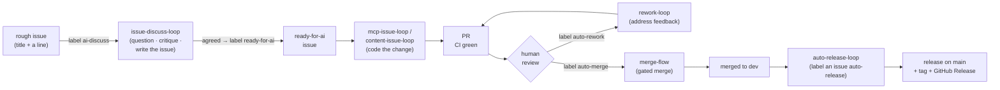
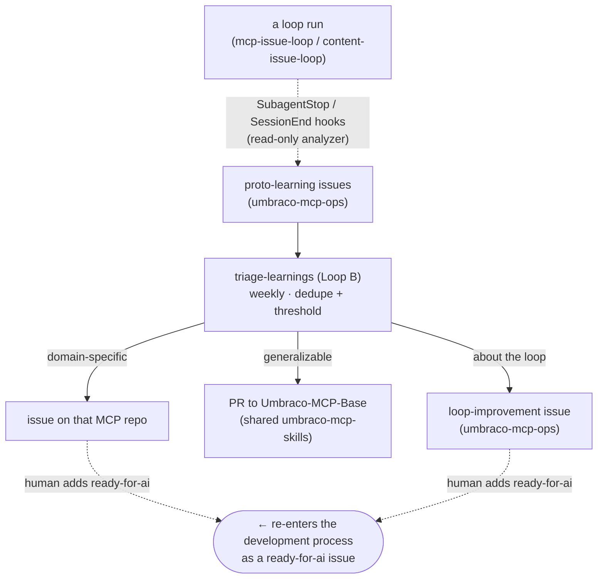
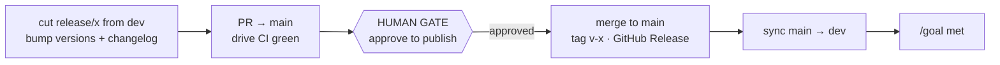

# The self-learning issue system — setup & operations

This repo hosts a set of `/goal`-driven **loops** that work the Umbraco MCP repos
autonomously *and* feed their own improvement back in. This guide is the single
place that explains **how it fits together**, **how to set it up**, and **how to
use it**. Each loop also self-documents in its own `SKILL.md`; this is the map.

## 1. The development process

How one unit of work flows from an issue to a shipped release — the forward path:


```mermaid
flowchart LR
    STUB["rough issue<br/>(title + a line)"] -->|"label ai-discuss"| DISCUSS["issue-discuss-loop<br/>(question · critique ·<br/>write the issue)"]
    DISCUSS -->|"agreed → label ready-for-ai"| ISSUE
    ISSUE["ready-for-ai<br/>issue"] --> CODE["mcp-issue-loop /<br/>content-issue-loop<br/>(code the change)"]
    CODE --> PR["PR<br/>CI green"]
    PR --> REVIEW{"human<br/>review"}
    REVIEW -->|"label auto-rework"| REWORK["rework-loop<br/>(address feedback)"]
    REWORK --> PR
    REVIEW -->|"label auto-merge"| MERGE["merge-flow<br/>(gated merge)"]
    MERGE --> MERGED["merged to dev"]
    MERGED --> REL["auto-release-loop<br/>(label an issue auto-release)"]
    REL --> SHIP["release on main<br/>+ tag + GitHub Release"]
```

**Human gates on this path:** the **`auto-merge` label** before merge (`merge-flow`
won't merge a PR that isn't labelled + green + clean), and the **`auto-release` label**
to start a release (`auto-release-loop` then ships it once CI is green — the deliberate
label is the decision; there's no separate publish pause). The loops automate the
mistake-prone mechanics; you keep the "ship this" decisions.

**The optional step in front:** `ai-discuss` (`issue-discuss-loop`). A rough issue gets
questioned, critiqued, and written up properly before it's worth building — the aim is
agreement on the smallest change that solves the problem. It never writes code and never adds
`ready-for-ai`; you do that when you're happy, which is also when you remove `ai-discuss`.
Skip it for issues that are already clear.

## 2. The self-learning loop

What the *same* loop runs emit as a byproduct, and how it compounds back into the
development process above:


```mermaid
flowchart TD
    LOOP["a loop run<br/>(mcp-issue-loop / content-issue-loop)"] -. "SubagentStop / SessionEnd hooks<br/>(read-only analyzer)" .-> PROTO["proto-learning issues<br/>(umbraco-mcp-ops)"]
    PROTO --> TRIAGE["triage-learnings (Loop B)<br/>weekly · dedupe + threshold"]
    TRIAGE -->|domain-specific| MREPO["issue on that MCP repo"]
    TRIAGE -->|generalizable| SHARED["PR to Umbraco-MCP-Base<br/>(shared umbraco-mcp-skills)"]
    TRIAGE -->|about the loop| LOOPIMP["loop-improvement issue<br/>(umbraco-mcp-ops)"]
    MREPO -. "human adds ready-for-ai" .-> BACK(["← re-enters the development process<br/>as a ready-for-ai issue"])
    LOOPIMP -. "human adds ready-for-ai" .-> BACK
```

**The compounding gate:** a proto-learning or loop-improvement issue only re-enters
the development process when a **human adds `ready-for-ai`** — nothing self-triggers.
Generalizable lessons instead become a drafted PR to the shared skills, so every MCP
repo benefits next time.

## The loops at a glance

| Loop | Plugin | What it does | Where it runs | Trigger |
|------|--------|--------------|---------------|---------|
| `issue-discuss-loop` | mcp-issue-loop | Talks an issue into shape *before* it's built — writes a stub issue properly, asks questions when it can't, or critiques a written issue antagonistically. One comment per fire; your reply fires the next round. Never writes code | Cloud routine (Issue: Labeled `ai-discuss`, or a comment on one) or local | label `ai-discuss` |
| `mcp-issue-loop` | mcp-issue-loop | Works `ready-for-ai` issues on an **MCP** repo → CI-green PR. *Local:* worktrees + parallel subagents + local tests + review loop. *Cloud:* one session/issue, CI-driven (no local Umbraco), stop at green PR | Dev machine **or** cloud routine (Issue: Labeled `ready-for-ai`) | label `ready-for-ai` |
| `rework-loop` | mcp-issue-loop | Address a PR's review feedback → re-green CI → re-request review (never merges) | Cloud routine (PR: Labeled `auto-rework`) or local | label a PR `auto-rework` |
| `content-issue-loop` | mcp-issue-loop | Same, for repos **without** the toolchain (this repo, `Umbraco-MCP-Base`, docs) | Dev machine or runner | "work the ready ops issues" |
| capture hooks | mcp-issue-loop | After each subagent, analyze the transcript and file `proto-learning` issues | Wherever the loop runs | automatic (`SubagentStop`/`SessionEnd`) |
| `triage-learnings` | mcp-issue-loop | Route proto-learnings → MCP-repo issue / shared-skills PR / loop-improvement issue | Web runner (scheduled) | "triage the learnings" |
| `merge-flow` | merge-flow | Merge PRs labelled `auto-merge` once green + conflict-free (the label is the approval) | Cloud routine (weekdays) | label `auto-merge` |
| `auto-release-loop` | release-flow | Cut branch, drive CI green, publish + tag + Release, sync `dev` — CI-gated, no approval pause | Cloud routine (Issue: Labeled) | label an issue `auto-release` |
| `loop-dispatch` | loop-dispatch | Front door that routes a triggering event → the matching loop above. Lets **one routine per repo** handle every loop event | Cloud routine (all loop events) or manual | any loop event on the repo |

Not a loop itself, but every loop above depends on it: **`github-ops`** — the shared
how-to for GitHub work in both environments (`gh` CLI locally, the GitHub MCP server on
the web). The loops defer all GitHub commands/tools to it.

**Scaling to many repos.** Rather than wiring one routine per loop per repo, wire **one**
routine per repo to all the loop events and point it at **`loop-dispatch`**; it routes
each event to the right loop (or sweeps them if the platform can't pass event
context). This needs a routine that can hold multiple event triggers and see which one
fired — otherwise keep per-event routines or run `loop-dispatch` in sweep mode on a
single trigger/schedule.

## Setup

### 1. Install the plugins

Inside Claude Code:

```
/plugin marketplace add hifi-phil/umbraco-mcp-ops
/plugin install mcp-issue-loop@umbraco-mcp-ops
/plugin install merge-flow@umbraco-mcp-ops
/plugin install release-flow@umbraco-mcp-ops
/plugin install github-ops@umbraco-mcp-ops
/plugin install dependabot-rollup@umbraco-mcp-ops
/plugin install loop-dispatch@umbraco-mcp-ops
/reload-plugins
```

Re-run the install (or `/plugin` update) + `/reload-plugins` after a version bump.

This `/plugin install` is **local only** (a dev machine, or a Desktop scheduled task —
the plugin is on disk). Cloud sessions/routines don't read your machine's plugins.

### 1b. Cloud / web delivery — the `cloud-skill-sync` setup script

Cloud routines load skills from the session's skills dir. Deliver them there with the
[`cloud-skill-sync`](../scripts/cloud-skill-sync/) **environment setup script**: paste
[`scripts/cloud-skill-sync/cloud-skill-sync.sh`](../scripts/cloud-skill-sync/cloud-skill-sync.sh)
into the cloud environment's **Setup script** field. On build it clones this (public)
repo and copies the listed skills into `$HOME/.claude/skills` **and every plugin agent
(e.g. `release-reviewer`) into `$HOME/.claude/agents`**, so any routine in that
environment can invoke the skills and spawn the agents.

- **No per-repo marketplace marker, no committed skill files, no manual upload, no
  token** — the public clone is anonymous, and the runner's egress proxy stays free for
  the routine's own GitHub work.
- Include at least **`github-ops`** (every loop references it by name) plus whichever
  loops you want in cloud — e.g. **`loop-dispatch`** (the front-door router),
  **`triage-learnings`**, **`merge-flow`**, **`rework-loop`**, **`mcp-issue-loop`**,
  **`issue-discuss-loop`**, **`open-work-report`**, **`branch-housekeeping`** (edit the
  script's `SKILLS` list; `loop-dispatch` is already listed).
  (**`dependabot-rollup` is local-only** — the Claude GitHub App can't read Dependabot
  alerts, so it can't run as a cloud routine. **`branch-housekeeping`'s report runs in cloud,
  but its `/clean-branches` command does not** — `commands/` aren't copied to the env, which is
  correct: there's no branch-delete tool there to call.) `mcp-issue-loop` runs in cloud in its **cloud mode** (one session per issue,
  CI as the test gate — no local Umbraco); its **local mode** (worktrees + `test:all` +
  the review loop + capture hooks) is dev-machine-only.
- **Refresh after a skill change:** bump `VERSION` in the script and re-save (the env
  snapshot is cached ~7 days; changing the source repo alone doesn't bust it). The repo
  stays the source of truth.

### 2. Labels

The system is label-driven. Create the labels on the repos that need them:

| Label | On which repo(s) | Purpose |
|-------|------------------|---------|
| `ai-discuss` | any repo where you want issues talked through first — it only *fires by itself* on repos that have the caller workflow committed (see below) | Discussion is open on this issue — question it, critique it, write it up. Comments address the loop by default; start one with `//` to talk to a colleague instead. **You** remove the label when satisfied; the loop never does |
| `ready-for-ai` | every MCP repo (and any repo a loop should work) | The only gate a loop acts on |
| `generated-by-ai` | every MCP repo a loop works | Set by `mcp-issue-loop` on success (replaces `ready-for-ai` when the CI-green PR opens) |
| `ai-blocked` | every MCP repo a loop works | Set by `mcp-issue-loop` when a backstop trips (replaces `ready-for-ai`; comment says why). Re-add `ready-for-ai` to retry |
| `proto-learning` | `hifi-phil/umbraco-mcp-ops` | Capture inbox |
| `triaged` | `hifi-phil/umbraco-mcp-ops` | Loop B routed it to a PR (skip next run) |
| `loop-improvement` | `hifi-phil/umbraco-mcp-ops` | A change to the loop itself, promoted from a learning |
| `auto-merge` | any repo where `merge-flow` runs | Merge me once approved + green |
| `auto-rework` | every MCP repo a loop works | On a PR: address the review feedback (rework-loop). Add it after leaving your comments |

```bash
# ops repo (inbox + loop bookkeeping)
gh label create ready-for-ai     --repo hifi-phil/umbraco-mcp-ops --color 0e8a16
gh label create proto-learning   --repo hifi-phil/umbraco-mcp-ops --color c5def5
gh label create triaged          --repo hifi-phil/umbraco-mcp-ops --color ededed
gh label create loop-improvement --repo hifi-phil/umbraco-mcp-ops --color 5319e7
gh label create auto-merge       --repo hifi-phil/umbraco-mcp-ops --color 0e8a16
gh label create ai-discuss       --repo hifi-phil/umbraco-mcp-ops --color d876e3

# each MCP repo you want the loop to work
gh label create ready-for-ai    --repo umbraco/<MCP-repo> --color 0e8a16
gh label create generated-by-ai --repo umbraco/<MCP-repo> --color c5def5
gh label create ai-blocked      --repo umbraco/<MCP-repo> --color d93f0b
gh label create auto-rework     --repo umbraco/<MCP-repo> --color fbca04
gh label create auto-merge      --repo umbraco/<MCP-repo> --color 0e8a16
gh label create ai-discuss      --repo umbraco/<MCP-repo> --color d876e3
```

(The ops-repo labels already exist; the per-MCP-repo ones are created as you enable
the loop on each.)

### 3. GitHub access & permissions

GitHub work follows the **`github-ops`** skill, which uses the mechanism the
environment offers:

- **Locally:** the `gh` CLI + `git` — your `gh` login covers everything, nothing to
  configure.
- **Claude web / scheduled routines:** the **GitHub MCP server** (`mcp__github__*`) —
  `gh` is not available there. Auth is the MCP server's connected GitHub App; no token
  to paste.

For the scheduled routines to act, that **connected app must grant, across both
`hifi-phil/umbraco-mcp-ops` and the `umbraco/*` repos:**

- `issues: write` — triage creates/labels/closes issues
- `pull_requests: write` — triage/merge-flow open and merge PRs
- `contents: write` — create branches, push files

`branch-housekeeping` splits in two, and only one half needs the App:

- The **skill is informational** — it classifies and reports, never deletes. It needs
  `metadata: read` + `pull_requests: read` and **no write scope**, so it runs happily as a
  **scheduled cloud routine** on the App (or locally via its script — same rules either way).
- The **`/clean-branches` command** does the deleting and is **local-only**, on your `gh` login
  (`contents: write`). Not because of permissions but because the capability doesn't exist on
  the cloud path: the MCP server has no branch-delete tool. Nothing schedules it.

It used to be a bash script calling the REST API with `curl` + a proxy-injected token, and
**that did not work in scheduled routines**. Don't reintroduce the `curl`+token pattern.

The Claude-driven routines need the broader grant above — confirm/expand it before
scheduling (a GitHub-App-installation decision, not a per-user token).

## Using the loops

- **Think an issue through first (optional):** label it `ai-discuss`. The loop questions,
  critiques, or writes it up, one comment at a time — reply and it fires again. When you agree
  it's right, remove `ai-discuss` and add `ready-for-ai`.
  **To ask a colleague something instead, start the comment with `//`** — that one never wakes
  the loop, so people can talk to each other on a watched issue. Everything else is treated as
  addressed to the loop (`/discuss …` or `@claude …` if you like being explicit).
  **Firing needs the caller workflow** (`.github/workflows/loop-dispatch.yml`) on the repo's
  default branch, plus the routine and its two secrets. The already-onboarded repos need the
  template **re-committed** to pick up the new `issue_comment` trigger — see `new-loop-routine`.
- **Complete issues:** label issues `ready-for-ai`, then run `mcp-issue-loop`
  (MCP repos) or `content-issue-loop` (ops/base/docs). Each opens a PR and waits
  for your review. Capture is automatic.
- **Merge:** approve a PR and add `auto-merge`; `merge-flow` merges it once CI is
  green and it's conflict-free (it never merges on a red or unapproved PR).
- **Triage learnings:** run `triage-learnings` (or let the weekly routine do it).
  It files issues to owning repos and drafts PRs only for the shared skills. You
  then decide which of its issues to promote to `ready-for-ai`.
- **Release:** open an issue titled `release <version>` and label it `auto-release`.
  `auto-release-loop` cuts the branch, bumps, drives CI green, then (CI is the gate —
  no approval pause) publishes + tags + Release and syncs `main`→`dev`, pushing you at
  start + completion.

## Runtime: dev machine vs web runner

- **Dev machine:** `gh` available. `mcp-issue-loop` *must* run here (Umbraco toolchain,
  worktree DB hooks, `npm run test:all`), and so must the two loops whose capability the
  cloud path lacks: `dependabot-rollup` (can't read Dependabot alerts) and
  **`/clean-branches`** (no branch-delete tool on the MCP path). Note that's the *command*
  only — `branch-housekeeping`'s report is informational and runs in either environment.
- **Web runner (event/scheduled):** `gh` is **absent** — routines do GitHub work through
  the **GitHub MCP server** (`mcp__github__*`), per `github-ops`. `triage-learnings`,
  `merge-flow`, `auto-release-loop`, `open-work-report`, and the `branch-housekeeping` **report**
  run here. There is no longer a `curl`/REST exception — every loop is a skill on the
  `github-ops` dual path.

  One consequence to know: the MCP server exposes **no branch-delete tool**, so a cloud
  routine cannot delete a branch and a merged branch surviving a cloud merge is expected.
  Two fixes, in order: turn on each repo's **"Automatically delete head branches"** setting
  (Settings → General → Pull Requests) so GitHub reaps at merge time — all three MCP repos
  have this on as of 2026-08-06 — or run `/clean-branches` by hand when it's worth it. The
  weekly `branch-housekeeping` report will not clean up for you; that's deliberate.

## Scheduled routines

Full inventory of cross-repo routines in this repo:

| Routine | Cadence | Status |
|---------|---------|--------|
| `branch-housekeeping` (skill) | weekly | **report-only**, runs **cloud or local** — one routine covers every repo in `repos.conf` and posts one digest. Deletes nothing ever, so it needs no authorisation and is safe to schedule. Cleanup is the separate **local-only** `/clean-branches` command, run by hand — never scheduled |
| `merge-flow` | on `auto-merge` label (event) | **to wire** |
| `auto-release-loop` | on `auto-release` label (event) | **to wire** |
| `dependabot-rollup` (skill) | weekly | **local-only** (cloud impossible — Claude GitHub App can't read Dependabot alerts) |
| `triage-learnings` | weekly | **to wire** |

`mcp-issue-loop` and `content-issue-loop` are human-initiated and not scheduled.
`auto-release-loop` is **event-triggered** (a routine on Issue: Labeled → `auto-release`),
not on a cron. Every web routine does its GitHub work via the GitHub MCP server (see
`github-ops`) — there are no exceptions left.

Wiring a cloud routine is two steps: (1) ensure the environment's **setup script**
delivers the skills it needs — the [`cloud-skill-sync`](../scripts/cloud-skill-sync/)
script, with at least `github-ops` plus the loop's own skill in its `SKILLS` list (§1b);
(2) **create the routine** pointing at the target repo with a prompt that invokes the
skill, e.g. `Run /merge-flow` for the merge loop. Cloud runs off the
skills delivered by the setup script, not `/plugin install`. (`dependabot-rollup` is the
exception — it's local-only; see §1b.)

### This repo runs the loops too

`umbraco-mcp-ops` has its own caller at
[`.github/workflows/loop-dispatch-caller.yml`](../.github/workflows/loop-dispatch-caller.yml) —
a copy of the locked template under a different filename, because the name
`loop-dispatch.yml` is taken here by the **reusable** workflow it calls. It points at
`…@main`, so this repo uses the same published router as everywhere else.

**It needs two secrets before it does anything:**

```bash
gh secret set LOOP_DISPATCH_FIRE_URL --repo hifi-phil/umbraco-mcp-ops   # Routines UI → Call via API
gh secret set LOOP_DISPATCH_TOKEN    --repo hifi-phil/umbraco-mcp-ops   # …→ Generate token
```

Both come from a `loop-dispatch → umbraco-mcp-ops` routine you create with
[`new-loop-routine`](../plugins/loop-dispatch/skills/new-loop-routine/SKILL.md) (model it on
the live `loop-dispatch → Umbraco-MCP-Base` one). Until they exist, a **matching** event fails
loudly with `LOOP_DISPATCH_FIRE_URL / LOOP_DISPATCH_TOKEN secret not set on this repo` — which
is the error you want; non-matching events still cost nothing. Meanwhile every loop skill can be
run by hand here.

One thing to know: `ready-for-ai` on this repo routes to **`content-issue-loop`**, not
`mcp-issue-loop` — there's no Umbraco toolchain here to build against.

## 3. Release-loop lifecycle (detail)


```mermaid
flowchart LR
    A["cut release/x from dev<br/>bump versions + changelog"] --> B["PR → main<br/>drive CI green"]
    B --> G{{"HUMAN GATE<br/>approve to publish"}}
    G -->|approved| C["merge to main<br/>tag v-x · GitHub Release"]
    C --> D["sync main → dev"]
    D --> DONE["/goal met"]
```

The `/goal` is not met until `dev` is synced — the step manual releases most often
forget.
